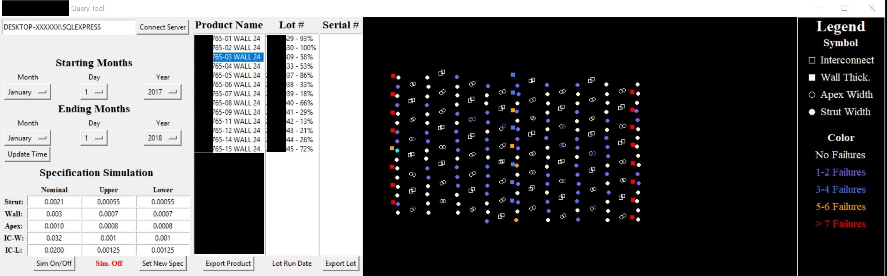

# Client-Example-Data-Engineering
Data Engineering work done for a client (example of my work)

## Overview of Work
*Note: Client allowed me to put this example up if I blacked out certain information and do not share the code (as it belongs to them).*
### Backstory
Client had 10 years worth of manufacturing data for various products they manufacture stored in a SQL database.  The production line was
meant to be shut down, but the decision was changed to keep it operational.  With yield suffering, they needed a way to look through a database with 80 million
entries and 300 measurement points per part to diagnose when/where problems started to occur.

### Solution
I created a tool in python to be able to select the following filter criteria:
* Time Period
* Product Type
* Lot #
* Serial Number

There is also 2 different types of heat maps discussed below:

**Product Specific:** This heatmap is finding every failing position for the entire product family in the time frame window.  It updates whenever you click
on a new product automatically.

**Serial Number Specific:** This heatmap is finding every failing point for the exact serial number.  It shows which points fail and which ones are close to failing.

Lot yields are automatically calculated and stored right next to the lot # in the 2nd column for an overall health check for each product.

There is also a simulation mode.  This allows you to change specifications to see how it would affect the product/lots as a whole if changed in future designs.  The
yield continues to update even in simulation mode. 

The last main feature is the ability to export to excel all the failures in a product or all the data for a specific lot of parts.  The simulation is taken into account
and will highlight specifications which have a simulated value for easy indentification.

##### Step 1 - Home Screen
The home screen allows you to connect to different databases using ODBC driver.  The time period is selected, then you push "Update Time" to start the querying.

##### Step 2 - Query Product
The product box is filled out with the SQL query to the database for the given time period.

##### Step 3 - Product Heat Map
Clicking on any product will automatically query the heatmap and the lot information for the given product family in the given time period.  The yield is shown
next to the lot numbers.  The heatmap is for a cylindrical stent which has been flattened out to better match engineering drawings.  

##### Step 4 - Lot Heat Map
Clicking any lot will populate the Serial # box.  All green Serial #s means the entire part passed inspection. Any red means it failed inspection at atleast 1 point.
When you click on the Serial #, it will change the heat map schema to a serial # specific one.  It will show exactly what failed and if it was below or above specification.
It will also show features which are close to failing with a threshold of 80% of specification being taken up. Clicking on any of the lots also shows when the lot was
run in production between "Export Product" and "Export Lot" button.

##### Step 5 - Export Lot
Clicking the "Export Lot" button will export whichever lot you currently have highlighted to excel.  The whole report is automatically generated with failing features
highlighted in red.  The button for "Export Product" is similar but will export all failing locations only for the whole product family.

##### Step 6 - Simulation
Clicking "Sim On/Off" button will restart your search critiera but with the specifications shown in the boxes.  This will automatically update all heatmaps and features
in the program. The "Simulation Running" will show up as green while the simulation is active.  Clicking the On/Off button again will turn it off.

